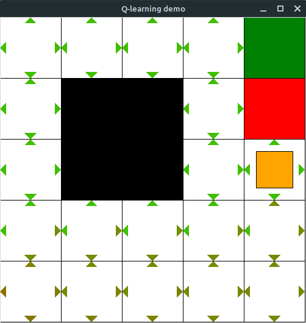

# Q Learning demo

This is the code for "How to use Q Learning in Video Games Easily" by Siraj Raval on [Youtube](https://youtu.be/A5eihauRQvo).

This version have been ported to Python 3.0. The original source code for Python 2.7 can be found [here](https://github.com/erilyth/Q-Learning-on-Mazes).

## Overview

This is the associated code for [this](https://youtu.be/A5eihauRQvo) video on Youtube by Siraj Raval. This is a simple example of a type of [reinforcement learning](https://en.wikipedia.org/wiki/Reinforcement_learning)
called [Q learning](https://en.wikipedia.org/wiki/Q-learning). 

* **Rules:** The agent (yellow box) has to reach one of the goals to end the game (green or red cell).
* **Rewards:** Each step gives a negative reward of -0.04. The red cell gives a negative reward of -1. The green one gives a positive reward of +1.
* **States:** Each cell is a state the agent can be.
* **Actions:** There are only 4 actions. Up, Down, Right, Left.

## Dependencies

- Python 3.
- Tkinter

If on Ubuntu you can install `tkinter` with `sudo apt-get install python3-tk` or via pip.

## Usage

Run `python Learner.py` in terminal to see the the bot in action. It'll find the optimal strategy pretty fast (like in 15 seconds).

## Challenge

The challenge for this video is to:

* modify the the game world so that it's bigger; 
* add more obstacles; and
* have the bot start in a different position.

**Bonus points if you modify the bot in some way that makes it more efficient**

A nice extension to the challenge can be found [here](https://github.com/erilyth/Q-Learning-on-Mazes).

## Credits

The credits for this code go to [PhillipeMorere](https://github.com/PhilippeMorere). I've merely created a wrapper to get people started.